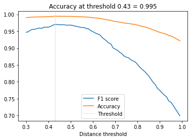

#  End to End Face-Recognition 

End to End Face-Recognition follows the approach described in [[1]](https://arxiv.org/abs/1503.03832) with modifications inspired by the OpenFace project. Keras is used for implementing the CNN, Dlib and OpenCV for aligning faces on input images. Face recognition performance is evaluated on a small subset of the LFW dataset which you can replace with your own custom dataset e.g. with images of your family and friends if you want to further experiment with the notebook. 

## Technology Used

 - Tensoflow
 - OpenCv
 - Python

##  Model Architecture
  
 
## `Preprocessing Pipeline`

  - Directory based image retrival
  
  - Face Extraction using `DLib` as per FaceNet paper and Face Alignment (eyes and mouth landmark based alignment)
  
## `Face Recognition Pipeline` 

  - Used pretrained 'nn4.small2.v1' model [[2]](https://cmusatyalab.github.io/openface/models-and-accuracies/#model-definitions)
  
  - Creating `Siamese Net` adding a triplet loss layer.
  
  - Used Tensorflow `Semihardloss`
  
  - Uses custom semi-hard online triplet Generator for fine-tuning
  
    - Generate the best triplet in the given batch of training.
   
 
## `Evaluation Pipeline` 

  - Used SVM,KNN,gnb
  
    
    
  - t-distributed Stochastic Neighbor Embedding (t-SNE) is applied to the 128-dimensional embedding vectors.
  
    
  
  
###  Status

- Image Extraction and `Preprocessing Pipeline` complete.
 
- `Model Pipeline` complete in Tensorflow.
  - Converted orignal model in csv to binary for tensorflow.
  - Creating `Siamese Net` adding a triplet loss layer.
  - Used Tensorflow `Semihardloss`.
  
- `Hard Triplet Generator` completed for further Fine-Tuning.
  - Made fast custom Image Data Generator for implementing Semi-Hard online 
    Triplet Generator.
    
### Features

- Online semi-hard triplet generator.

- Fine-tuning to custom dataset.

- Less GPU extensive as uses pre-trained model as base to fine-tune to.

- Fast Generator

### Next Todo:

- Visualization
- Model evaluation and metrics

